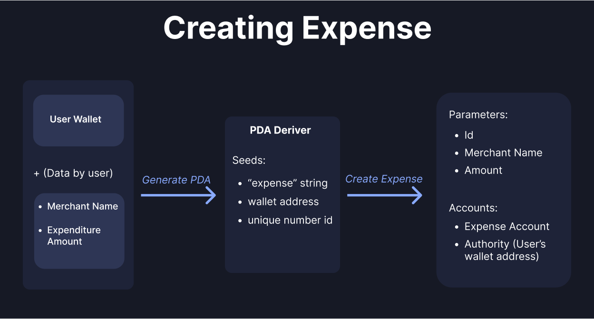
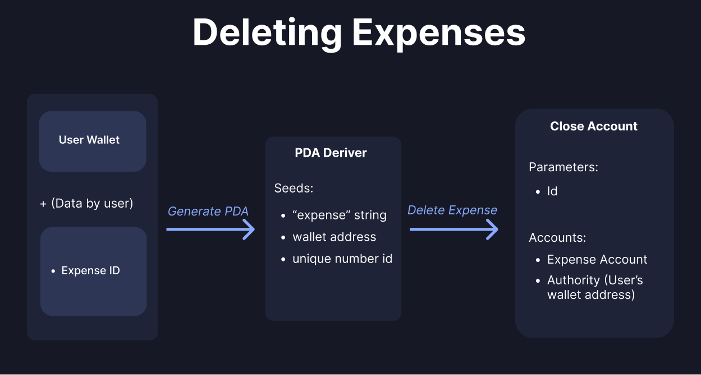

# Expense Tracker

## 🎬 Recorded Sessions
| Link        | Instructor | Event |
| ----------- | ---------- | ----- |
| Coming Soon | -          | -     |

## ☄️ Open in Solana Playground IDE
| Program         | Link                                                                                                                                                                               |
| --------------- | ---------------------------------------------------------------------------------------------------------------------------------------------------------------------------------- |
| Expense Tracker | [ ](https://beta.solpg.io/645acbc1d6ebe745da20439e) |


## 📗 Learn

In this workshop, we'll learn about PDAs and their use in Solana by creating a simple expense tracking app. 

The app has a simple UI to connect to a wallet and view expenses in tabular form and a distribution chart. You can add new expenses, update existing ones, or delete them.

Each expense is a PDA (Program Derived Address) owned by the user who creates it. Refer to the [Diagrams](#diagrams) section to gain a deeper understanding of it.

### PDAs
A Program Derived Address (PDA) is an account whose public key is created using an algorithm based on the program's address. Unlike regular accounts, PDAs don't have private keys and can perform actions without needing signatures from clients or user wallets.

To create a PDA, we need to provide "seeds" which are external data as bytes. Seeds can be any data like a wallet address, string, or unique ID. PDAs are deterministic, which means we can create and derive them again and again using the same seeds. We can perform actions for our PDA accounts using the derived public key.

Seeds often include a unique ID which is helpful when dealing with our expense entry data. By using the unique ID of an expense entry, we can easily derive its PDA and get the on-chain account by passing the ID in seeds.

In our case, we are using PDAs as separate accounts that are owned by the user. The user has control over these PDA accounts, which represent individual expense entry data.

> Note: PDAs are **derived** using an algorithm. We can get them using PublicKey.findProgramAddressSync from `@solana/web3.js`. PDAs are NOT fetched from on-chain data, only accounts are **fetched**.

### Client Code
Let's go through the code and understand how our client works.
1. Program Interaction
- 1.1 Creating Anchor Provider
- 1.2 Adding IDL
- 1.3 Deriving PDAs in client
- 1.4 Understanding Instruction Calling
- 1.5 Fetching on-chain data

2. Rendering data
- 2.1 Creating expense data table
- 2.2 Creating Chart


#### 1.1 Creating Anchor Provider
To get started, we create an Anchor provider, which will interact with our Solana program. Go to [/app/src/util/anchorProgram.ts](/app/src/util/anchorProgram.ts)

We first create an anchor program provider that will help us interact with our program. Note that it takes in our `IDL`. We will understand more about the IDL next. 
```ts
// Line 26

export const anchorProgram = (wallet: anchor.Wallet, network?: string) => {
  const provider = getProvider(wallet, network);
  const idl = IDLData as anchor.Idl;
  const program = new anchor.Program(
    idl,
    new PublicKey(DEVNET_PROGRAM_ID),
    provider
  ) as unknown as anchor.Program<IDLType>;

  return program;
};
```

#### 1.2 Adding IDL
When you build your program, in the `target/` directory, your program's IDL is created. IDL is essentially the strucuture of your entire program, including all instructions, instruction params and all accounts. 
The IDL is saved in a JSON file. We have to copy it in our client code and save it as a type so that we can easily work with our anchor provider with type annotations and checking. In this repository, the IDL is present in [/app/src/util/idl.ts](/app/src/util/idl.ts) file

#### 1.3 Deriving PDAs in client
We learnt in the [PDAs](#PDAs) section above about PDAs. Let's see how we derive it in the client. Open up any file from the [/app/src/util/program](/app/src/util/program) directory.
For example, to derive an expense's account PDA, we're using
```ts
// Line 17, createExpense.ts

let [expense_account, bump] = anchor.web3.PublicKey.findProgramAddressSync(
    [
        Buffer.from("expense"), 
        wallet.publicKey.toBuffer(),
        Buffer.from(String(id))
    ],
    program.programId
);
```
The `findProgramAddressSync` function takes in a seeds array and program ID.
In our program, the seeds are: "expense" string, wallet public key and id of our expense entry. You can see how it works in [Diagrams](#Diagrams) section
This function returns out PDA and bump that kicked the public key off the ED2559 curve. Let's see how we can use this PDA and interact with our program in client

#### 1.4 Understanding Instruction Calling
Let's open [/app/src/util/program/createExpense.ts](/app/src/util/program/createExpense.ts) to understand how we're calling the `initializeExpense` instruction to add a new expense entry through client.
The function is deriving a PDA first, which we've covered, let's look at the important part, which is:
```ts
// Line 23

const sig = await program.methods.initializeExpense(
    newId,
    merchantName,
    new anchor.BN(itemAmount)
).accounts({
    expenseAccount: expense_account,
    authority: wallet.publicKey,
})
    .rpc()
```
Here, we are using our program provider to access the `initializeExpense` method. We are able to access it because of the IDL type that we added. The method takes in the parameters that we defined in our program, which are the unique ID, merchant name, and the amount we spent.

Next, we need to enter all the accounts that are required for this method. First, we are passing our PDA for `expenseAccount`, which will become our on-chain account holding the expense data. This is followed by the `authority`, which is simply who has ownership of the account. Naturally, the user should have ownership of their expense accounts, so we are setting it to our wallet's public key.

Similarly, we are calling all other instructions in the client for updating and deleting expenses.

#### 1.5 Fetching on-chain data
We've understand how to call instructions in our Solana program through client. But, how do we fetch the on-chain data?

Let's open up [app/util/program/getExpenses.ts](/app/src/util/program/getExpenses.ts).

We're fetching all expense accounts in this part:
```ts
// Line 12

const expenses = await program.account.expenseAccount.all()
```

We're getting out expenseAccount and using the `all()` method to get all expense accounts. We can also fetch indiviual accounts by using the `fetch()` method and passing our PDA instead.

#### 2.1 Creating expense data table
Now, let's see where and how we are rendering out data.
Open up [/app/src/components/MyExpenses.tsx](/app/src/components/MyExpenses.tsx)
Notice this part:
```ts
// Line 47

useEffect(() => {
    if (!wallet) {
        setExpenses([])
        return
    }
    const run = async () => {
        const data = await getExpenses(wallet as NodeWallet)
        setExpenses(data)
    }
    run()
}, [wallet])
```
Here, we're calling the `getExpenses` function which we have defined in [/app/src/utils/program/getExpenses.ts](/app/src/utils/program/getExpenses.ts).
When we get the data, we're storing it in our expenses state, which is being rendered at the bottom as a table from Chakra UI components

#### 2.2 Creating Chart
Finally, the chart which you see on the right side is defined in [/app/src/components/DistributionChart.tsx](/app/src/components/DistributionChart.tsx).
Using the `chart.js` library, we're passing the same data we get from `getExpenses`, filtering it a bit to be entered in Chart.js' data format and returning a simple Doughnut chart.


### How to Build & Run

1. You would need to deploy the program on Solana blockchain first. You can either:
    - Click on the [Solana Playground](https://beta.solpg.io/645acbc1d6ebe745da20439e) link and deploy it 
    - Install [Anchor](https://www.anchor-lang.com/), Rust and Solana CLI. Then head over to `/anchor-program` directory and follow instructions from Anchor docs to deploy the program to devnet.

2. To launch the frontend, head over to `/app/src` directory and enter: `yarn install && yarn dev`

### Diagrams

